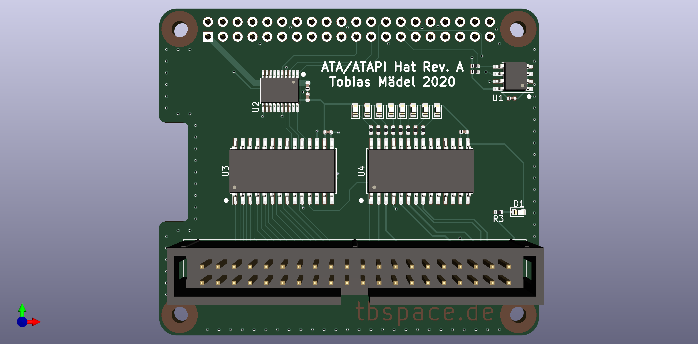

ATAPIHat
=============================

#### Overview

#### Rev. A Errata
Reset is wrong, is hardpulled to ground. Solution: connect to GPIO17. 
Chip select is non-ideal (solder jumper?)
Selectable 5V on Pin 20 required
IDE Reset line should be connected to LED7 aka pin 28 of U4

#### Additional info

[Firmware](https://github.com/Manawyrm/ATAPIHat-Firmware)  
[Schematic](https://github.com/Manawyrm/ATAPIHat/blob/master/ATAPIHat.pdf)  
